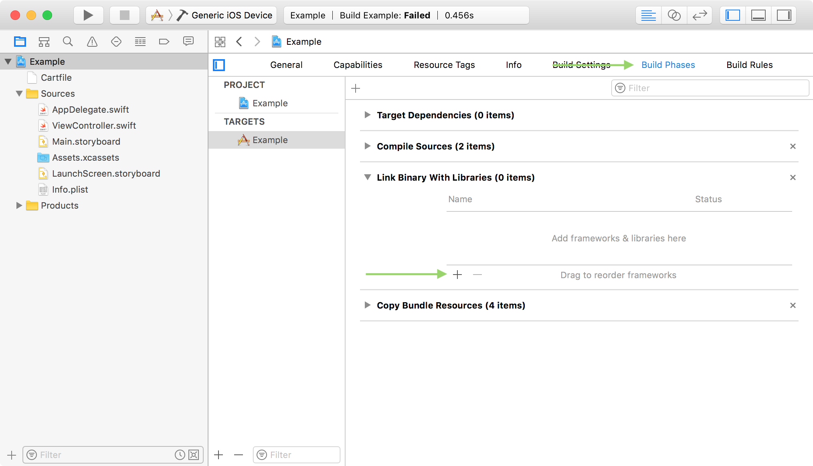
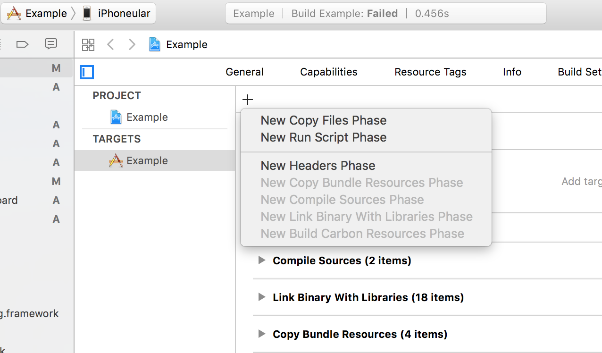
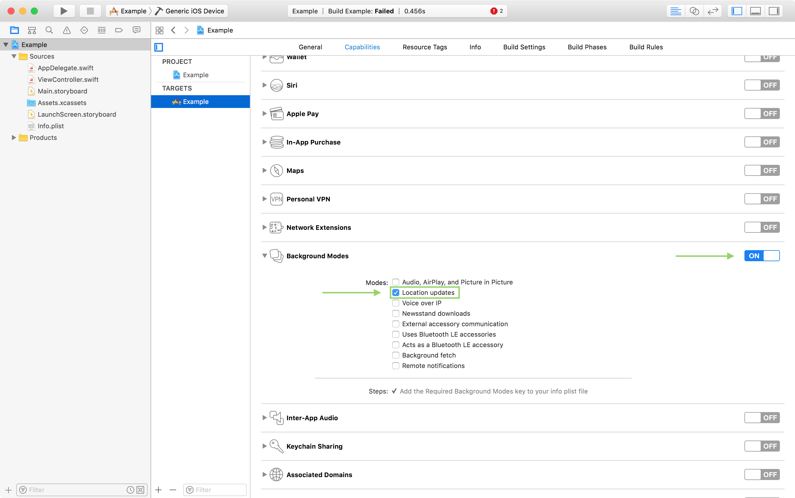
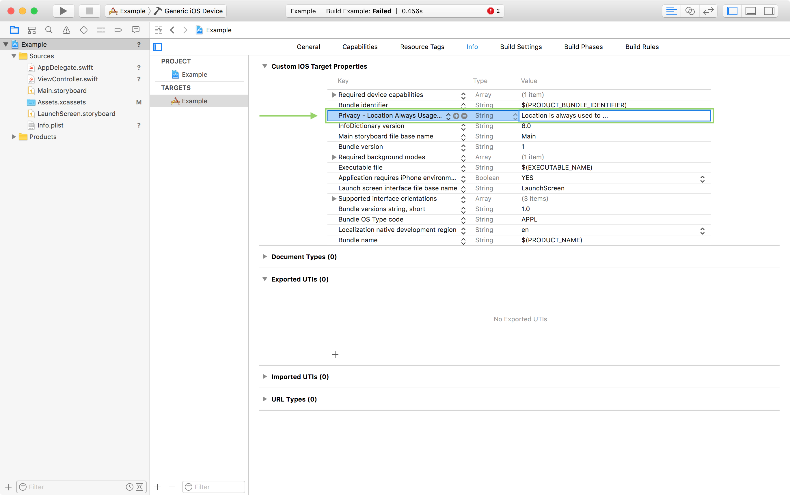

# Getting Started

## Requirements

* iOS 8.0+
* Xcode 9.1
* Register for a [predict.io API key](http://www.predict.io/service/registration/?level=1)

## Installation (CocoaPods)

Installation via CocoaPods can be accomplished by adding one of the following to your `Podfile`:

```ruby
pod 'PredictIO', '~> 5.1.0'
```

## Installation (Carthage)

Add this to your `Cartfile`:

```
github "predict-io/PredictIO-iOS" ~> 5.1.0
```

And install...

```
$ carthage update --platform iOS  --cache-builds
```

### Link Binary with Libraries

Link your app with the following _System Frameworks_:

* `AdSupport.framework`
* `CoreLocation.framework`
* `CoreMotion.framework`
* `Foundation.framework`
* `SystemConfiguration.framework`
* `libz.tbd`



Once you've run the previous Carthage command you can add the SDK and its dependencies to your app also:

1. `PredictIO.framework`
2. `Reachability.framework`
3. `Realm.framework`
4. `RealmSwift.framework`
5. `RxSwift.framework`
6. `SwiftyJSON.framework`
7. `SwiftyUserDefaults.framework`


### Add 'Copy Frameworks' Build Phase

Create a _'New Run Script Phase'_ with the following contents:

```
/usr/local/bin/carthage copy-frameworks
```



Under *Input Files* add an entry for each of the following items:

1. `$(SRCROOT)/Carthage/Build/iOS/PredictIO.framework`
2. `$(SRCROOT)/Carthage/Build/iOS/Reachability.framework`
3. `$(SRCROOT)/Carthage/Build/iOS/Realm.framework`
4. `$(SRCROOT)/Carthage/Build/iOS/RealmSwift.framework`
5. `$(SRCROOT)/Carthage/Build/iOS/RxSwift.framework`
6. `$(SRCROOT)/Carthage/Build/iOS/SwiftyJSON.framework`
7. `$(SRCROOT)/Carthage/Build/iOS/SwiftyUserDefaults.framework`

# Usage

## Configure your project

### 1. Enable Background Location Updates

Location is used efficiently while in the background, having minimal effect on battery usage. To enable _Background Location Updates_ open your Project Settings, select your App Target, choose _Capabilities_, enable _Background Modes_ and check _Location updates_.



> **NOTE** You are required to handle the location permissions request in your application with your own implementation.

### 2. App Usage Descriptions to `Info.plist`

iOS requires you provide the user with a meaningful description of why you will be using their location. It's required that you add the following to your `Info.plist`:

* **Privacy - Location Always Usage Description** (`NSLocationAlwaysUsageDescription`)
* For iOS 11+ **Privacy - Location Always and When In Use Usage Description** (`NSLocationAlwaysAndWhenInUseUsageDescription`)



## Integrate the SDK

```swift
import PredictIO

let apiKey = "<YOUR_API_KEY>"

PredictIO.instance.start(apiKey) {
  (error: PredictIOError?) in
    
  switch error {
    case .invalidKey?:
    // Your API key is invalid (incorrect or deactivated)
    break

    case .killSwitch?:
    // Kill switch has been enabled to stop the SDK
    break

    case .wifiDisabled?:
    // User has WiFi turned off significantly impacting location accuracy available.
    // This may result in missed events!
    // NOTE: SDK still launches after this error!
    break
    
    case .locationPermission(let authStatus)?:
    // There is a problem with the user's location permissions.
    // They may need to be requested by your app or the permission
    // is not available on this user's device.
	switch authStatus {
    	case .notDetermined:
      	// Background location permission has not been requested yet.
      	// You need to call `requestAlwaysAuthorization()` on your
      	// CLLocationManager instance where it makes sense to ask for this 
        // permission in your app.
      	break
      	
      	case .restricted:
		// This application is not authorized to use location services.  Due
		// to active restrictions on location services, the user cannot change
		// this status, and may not have personally denied authorization
		break
      
      	case .authorizedWhenInUse:
      	// User has only granted 'When In Use' location permission, and 
        // with that it is not possible to determine trips which are made.
      	break
      
      	case .denied:
      	// User has flat out denied to give any location permission to
      	// this application.
      	break
      
      	// Reamining CLAuthorizationStatus are unused and switch
      	// must be exhaustive!
      	default:break
    }
    
    case nil:
    // No error, SDK started with no problems
    print("Successfully started PredictIO SDK!") 
    break
  }
}
```

# Support

Visit our [Help Center]([https://support.predict.io](https://support.predict.io/)), open an Issue or send an email to [support@predict.io](support@predict.io).
